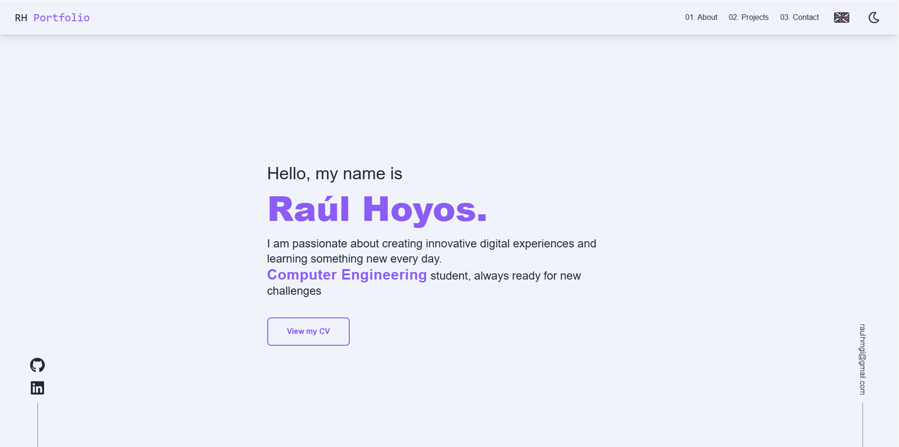
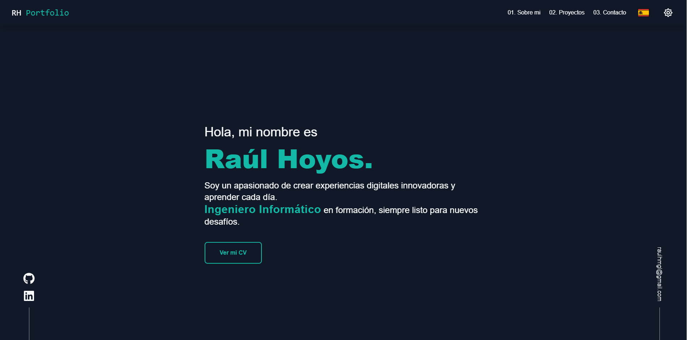
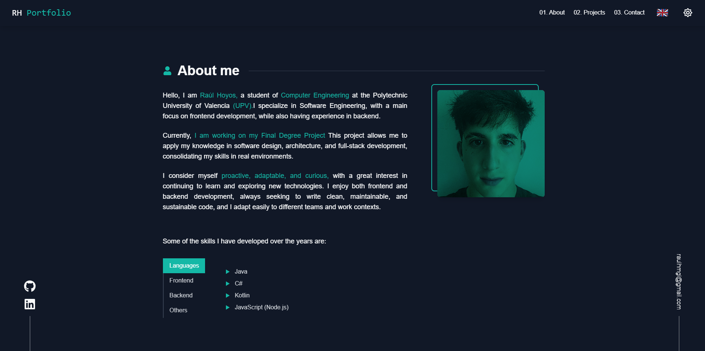
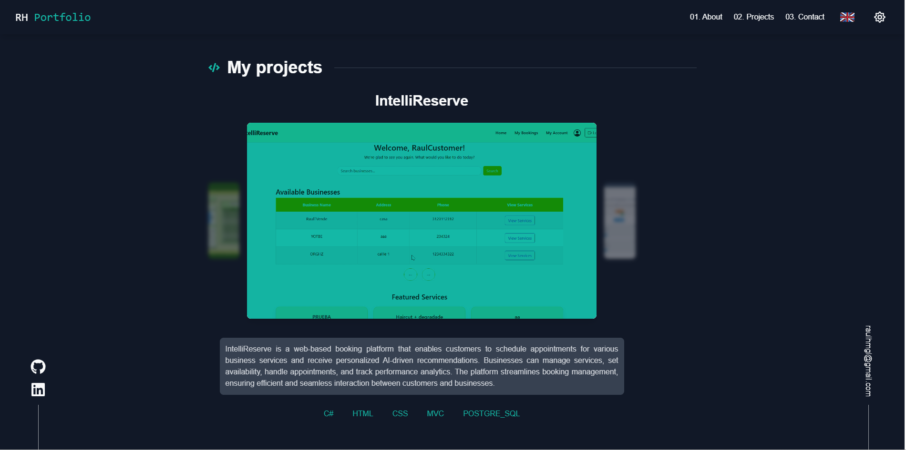
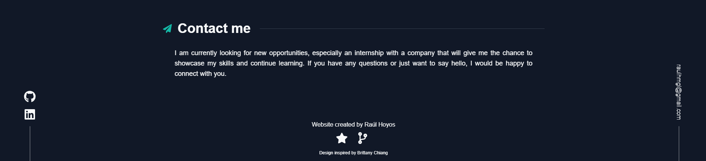

# 📌 My Portfolio

---

## 🧠 Description
**[Personal Portfolio Website]** built with React and Tailwind CSS.
Showcases my academic and personal projects, skills, and contact information. Includes sections such as About Me, Projects, and Contact, with a responsive design and dark/light theme support and different languages EN/SP.

🌐 **View Online:** [raulhoyosportfolio](https://portfolio-raulhoyos.netlify.app/)

---

## ⚙️ Technologies Used

- **Frontend:** React ⚛️, JavaScript ES6+
- **Styling:** Tailwind 🎨 (Dark/Light theme)
- **Internationalization:** i18next 🌍
- **Icons:** react-icons (Fa)

---

## 📦 Installation

1. Clone the repository:

   git clone https://github.com/RaulHoyoss/My-Personal-Portfolio
   cd My-Personal-Portfolio

2. Install Dependencies:

    npm install

3. Run the app in development:
    
    npm start

4. Build the app for production:

    npm run build

---   

## 🖼️ Screenshots

### MAIN INTERFACE

####

####

####

####

####

##  License

This project is licensed under the MIT License. [LICENSE](LICENSE) file for details.

## Contact 

- Raúl Hoyos : raulhzmgl@gmial.com 

- GitHub Repository: https://github.com/RaulHoyoss

